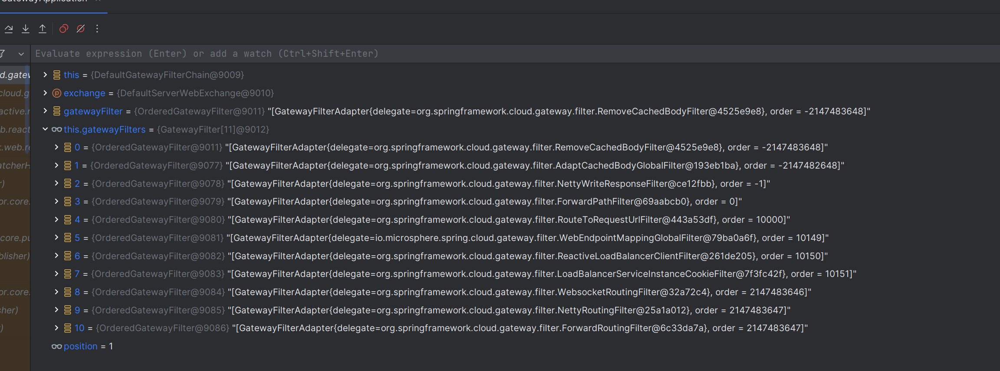
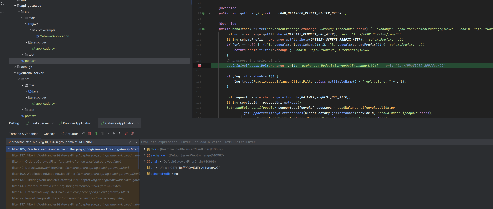
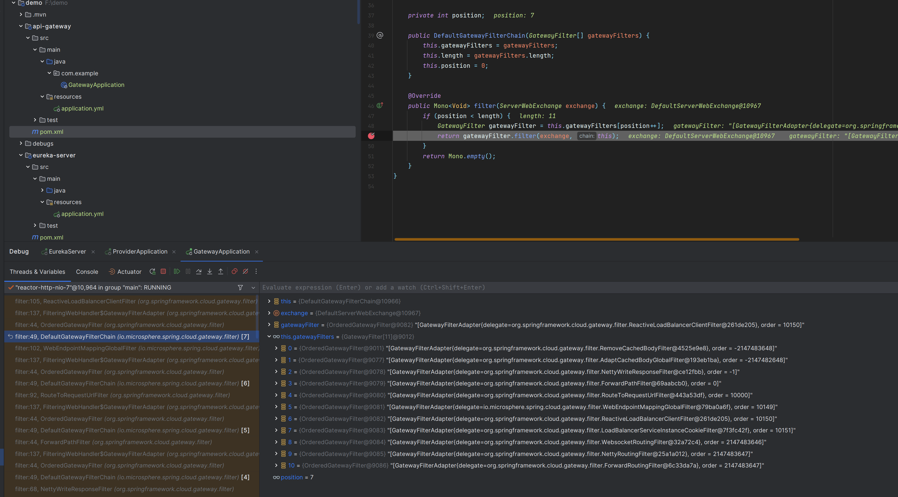
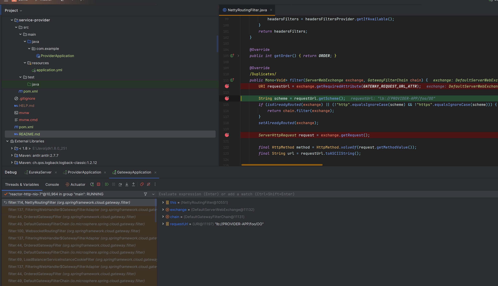
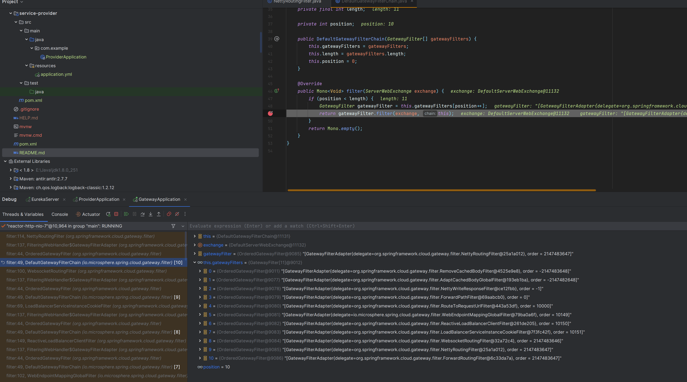
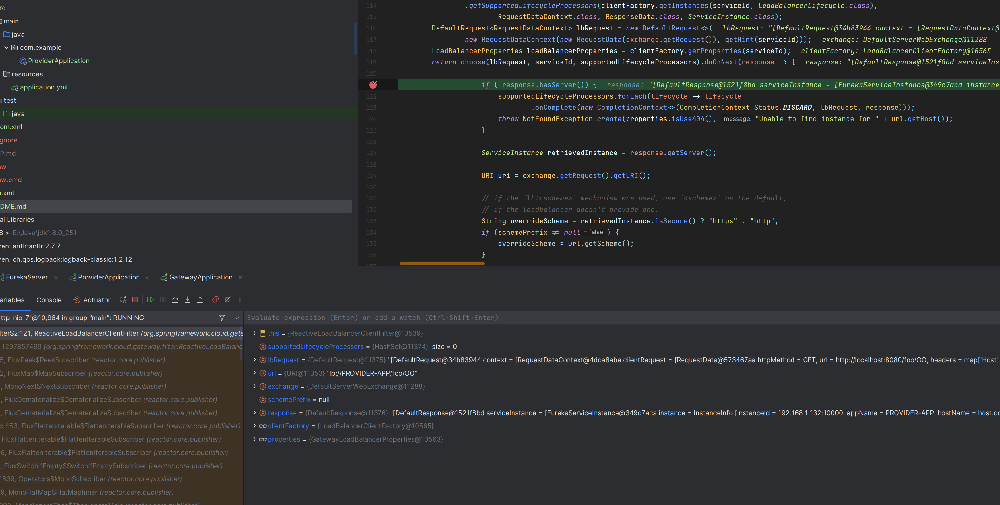

## 问题复现

# 正常情况
分别启动`eureka-server`,`service-provider`,`api-gateway`

GET请求http://localhost:8080/foo/OO

返回结果
```text
foo: OO
```

# 异常情况
1.增加依赖
```xml
<dependency>
    <groupId>io.github.microsphere-projects</groupId>
    <artifactId>microsphere-spring-cloud-gateway</artifactId>
</dependency>
```

2.再次GET请求http://localhost:8080/foo/OO

此时无任何响应

# 问题排查
### 1.`DefaultGatewayFilterChain`调用链路

此时`ReactiveLoadBalancerClientFilter`位于`NettyRoutingFilter`前,应该优先执行

在`ReactiveLoadBalancerClientFilter`中,存在负载均衡替换请求url的代码
```java
return choose(lbRequest, serviceId, supportedLifecycleProcessors).doOnNext(response -> {
        if (!response.hasServer()) {
        //...
        ServiceInstance retrievedInstance = response.getServer();
        URI uri = exchange.getRequest().getURI();
        //...
        URI requestUrl = reconstructURI(serviceInstance, uri);
        //替换url
        exchange.getAttributes().put(GATEWAY_REQUEST_URL_ATTR, requestUrl);
        /...
```
因此此段代码的执行,关联到后续`NettyRoutingFilter`转发路由请求

### 2.代码进入`ReactiveLoadBalancerClientFilter`

此时代码第一次进入`ReactiveLoadBalancerClientFilter`,回到`DefaultGatewayFilterChain`,此时发现position=7,属于正常情况


### 3.代码进入`NettyRoutingFilter`
此时按正常情况,代码应进入`ReactiveLoadBalancerClientFilter`中替换url的部分,但实际上程序却提前进入到了`NettyRoutingFilter`

可以看到,`NettyRoutingFilter`获取到的url,仍然是lb://PROVIDER-APP/foo/OO,因为不是http协议,故此时直接跳过.

同时观察`DefaultGatewayFilterChain`

此时position=10,说明已经跳过了负载均衡重写url的代码,导致`NettyRoutingFilter`无法正常转发请求

### 4.重写url
在执行的最后,程序才进入`ReactiveLoadBalancerClientFilter`进行url的重写,但此时已经为时已晚
